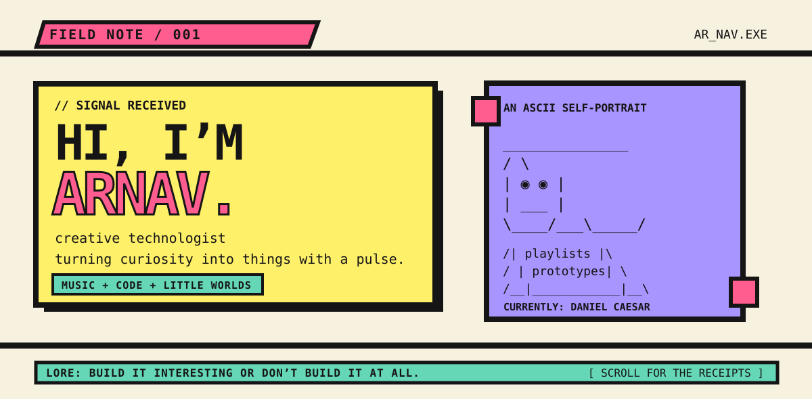

<p align="center">
  
</p>

<p align="center">
  <a href="https://github.com/andy1924?tab=repositories"><strong>[ OPEN THE WORKSHOP ]</strong></a>
  &nbsp; <a href="https://github.com/andy1924?tab=stars">[ FIND MY TASTE ]</a>
</p>

```text
┌──────────────────────────────────────────────────────────────┐
│ STATUS: MAKING THINGS I WOULD WANT TO STUMBLE UPON ONLINE.  │
└──────────────────────────────────────────────────────────────┘
```

## hello, i’m arnav.

I build with code, collect strange ideas, and take the bit seriously. This page is a field note from someone who thinks software should have texture, mood, and a reason to exist.

Right now, I’m deep in **Python**, **LLMs**, and things that make patterns visible. [**Agentic Chat Analyzer**](https://github.com/andy1924/Agentic-Chat-Analyzer) turns chat exports into behavioral signals and an explorable dashboard — a little equalizer for human connection.

<table>
  <tr>
    <td width="50%" valign="top">
      <h3>01 — current soundtrack</h3>
      <pre>Daniel Caesar
after dark / headphones on
building something that feels alive</pre>
    </td>
    <td width="50%" valign="top">
      <h3>02 — character sheet</h3>
      <pre>class: creative technologist
trait: keeps going down the rabbit hole
inventory: ideas, tabs, playlists</pre>
    </td>
  </tr>
</table>

<details>
<summary><strong>▣ field manual / what I’m here for</strong></summary>

<br />

```text
mission:      make useful things with a pulse
method:       curiosity → prototype → obsession → ship
weakness:     interfaces with no personality
favourite loot: a difficult problem and a good song
```

I’m interested in AI that feels less like a vending machine and more like an instrument: thoughtful, expressive, and made for people.

</details>

<details>
<summary><strong>▣ open a hidden pocket</strong></summary>

<br />

```text
you found the part of the profile that says:

      make it weird enough that you remember it.

                — arnav, probably at 1:47am
```

</details>

<br />

<p align="center"><sub>built in public-ish · powered by curiosity · currently playing Daniel Caesar</sub></p>
