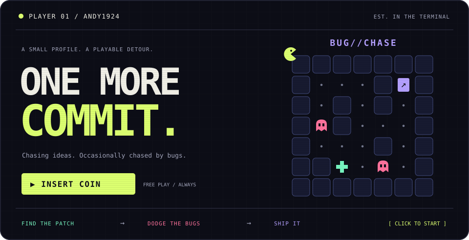
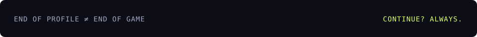

<a href="arcade/room-1-1-0.md">
  
</a>

<p align="center">
  <a href="arcade/room-1-1-0.md"><strong>▶ INSERT COIN · PLAY BUG//CHASE</strong></a>
  &nbsp;&nbsp; / &nbsp;&nbsp;
  <a href="https://github.com/andy1924?tab=repositories">EXPLORE THE CODE ↗</a>
</p>

<p align="center"><sub>One patch. Two bugs. One way to ship. A tiny click-to-move adventure, right here on GitHub.</sub></p>

---

### Player one has entered the chat.

I'm **andy1924**. Welcome to my little corner of the internet—with a side quest built in.

I like code that does something interesting. Take [**Agentic Chat Analyzer**](https://github.com/andy1924/Agentic-Chat-Analyzer): chat exports become communication patterns, LLM-powered profiles, and an interactive dashboard. **Python · LangChain · Streamlit.**

| `01 / THE SIDE QUEST` | `02 / THE SOURCE` | `03 / THE SAVE FILE` |
| :--- | :--- | :--- |
| Find the patch. Dodge the bugs. Unlock the exit. | Projects, experiments, and whatever comes next. | Things I've bookmarked along the way. |
| [**Start a run →**](arcade/room-1-1-0.md) | [**Browse repositories ↗**](https://github.com/andy1924?tab=repositories) | [**Explore stars ↗**](https://github.com/andy1924?tab=stars) |

<details>
<summary><strong>▸ Open the arcade manual</strong></summary>

<br />

**BUG//CHASE** is a small maze played with links. Every move opens the next room.

- **Yellow** is you. Use the arrow links below the board to move one tile.
- Pick up the **mint `+` patch**, then reach the **purple exit** in the top right.
- **Pink bugs** are stationary traps. Step on one and your run ends.
- The exit stays locked until you have the patch. A full map is visible, so plan your route.

No sign-in, install, or external game page. Your position and inventory travel in the room link. [**Let's play →**](arcade/room-1-1-0.md)

</details>

<details>
<summary><strong>▸ Inspect the suspiciously placed wall</strong></summary>

<br />

```text
  YOU FOUND A SECRET ROOM.

  +100 curiosity
  +0 meetings that could have been an email

  The real high score is shipping something you care about.
```

[Return to the maze →](arcade/room-1-1-0.md)

</details>

<br />


