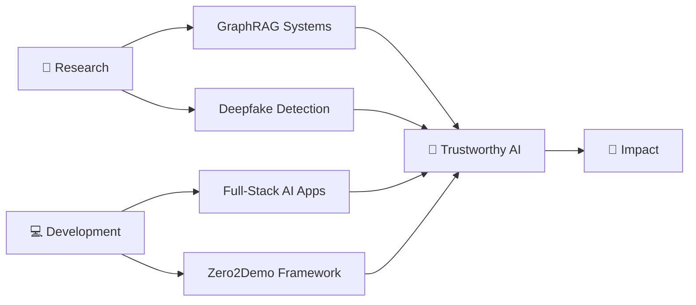

<div align="center">

# 👋 Hey there, I'm Arnav Deshpande


[](https://www.linkedin.com/in/arnav-deshpande-35251b202/)
[](mailto:deshpandearnavn@gmail.com)
</div>

---

## 🚀 About Me

```python
class ArnavDeshpande:
    def __init__(self):
        self.username = "ArnavDeshpande"
        self.role = "AI Researcher & Full-Stack Developer"
        self.education = "First-Year Computer Engineering @ NMIMS"
        self.location = "Mumbai, India 🇮🇳"
        
    def current_focus(self):
        return {
            "research": "Mitigating LLM Hallucinations with GraphRAG",
            "projects": ["Zero2Demo", "CNN-based Deepfake Detection"],
            "learning": ["Advanced DSA in C++", "Deep Learning Architectures"],
            "building": "Full-stack AI applications (Next.js + FastAPI)"
        }
    
    def philosophy(self):
        return "Turning complex theoretical concepts into functional, real-world code"
```

I'm obsessed with making AI **more trustworthy and context-aware**. My current research focuses on taming those pesky LLM hallucinations using **GraphRAG**, while simultaneously building **CNNs for deepfake image detection** to keep our digital world authentic.

While my core focus sits at the **intersection of Generative AI and digital security**, I'm a builder at heart. Whether I'm writing core logic in **C++ and Python**, or spinning up the front and back end of a new project using **Next.js and FastAPI**, I enjoy owning the entire process of bringing an intelligent system to life.

**🎯 Fun Fact:** When I'm not hunting bugs, I'm hunting for the next pair of Asics or New Balance sneakers! 👟

---

## 🔥 What I'm Building Right Now

<table>
  <tr>
    <td width="50%">
      <h3 align="center">🎯 Zero2Demo</h3>
      <p align="center">
        
      </p>
      <p align="center">Rapid prototyping framework for turning ideas into working demos</p>
    </td>
    <td width="50%">
      <h3 align="center">🕸️ GraphRAG System</h3>
      <p align="center">
        
      </p>
      <p align="center">Fighting LLM hallucinations with knowledge graphs and retrieval augmentation</p>
    </td>
  </tr>
  <tr>
    <td width="50%">
      <h3 align="center">🔍 Deepfake Detector</h3>
      <p align="center">
        
      </p>
      <p align="center">CNN-powered image forensics for detecting AI-generated content</p>
    </td>
    <td width="50%">
      <h3 align="center">📚 DSA Mastery</h3>
      <p align="center">
        
      </p>
      <p align="center">Deep diving into advanced data structures with C++</p>
    </td>
  </tr>
</table>

---

## 💻 Tech Arsenal

<div align="center">

### 🧠 Core Languages


### 🤖 AI/ML Stack


### 🗄️ Databases & Graph Tech


### 🎨 Creative & Design Tools


### 🛠️ Tools & DevOps


</div>

---

---

## 🎯 Current Mission

<div align="center">



</div>

**Building AI systems that you can actually trust** — because the future of intelligent software shouldn't come with an asterisk.

---

## 💭 Random Dev Wisdom

<div align="center">


</div>

---

## 🤝 Let's Connect!

<div align="center">

I'm always excited to collaborate on projects at the intersection of **AI, security, and full-stack development**. Whether you want to discuss GraphRAG architectures, deepfake detection techniques, or just chat about the latest sneaker drops—feel free to reach out!

[](https://www.linkedin.com/in/arnav-deshpande-35251b202/)
[](mailto:deshpandearnavn@gmail.com)


</div>

---

<div align="center">

### 🌟 "*Code is poetry, and every bug is just a plot twist*" 🌟

**⭐ If you like what I'm building, consider starring my repos!**

</div>
