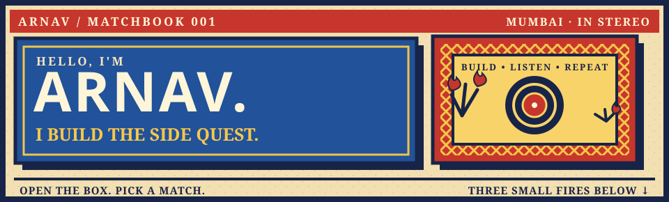
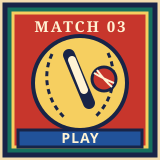

<p align="center">
  
</p>

### Hi, I'm Arnav.

I'm a Computer Engineering student at NMIMS in Mumbai. My projects usually start with *“wait, what if…”* and then take a detour I didn't plan for. The current soundtrack is **Daniel Caesar**.

Those detours have led me from rural business tools to AI grounded in evidence to cricket analysis. I like that range. A side quest is still worth finishing.

### Pick a match

<table>
  <tr>
    <td width="170"><a href="https://github.com/andy1924/UdyogSaarthi"></a></td>
    <td><strong>01 / For people — <a href="https://github.com/andy1924/UdyogSaarthi">UdyogSaarthi ↗</a></strong><br>Making business planning, finance, and compliance easier to navigate for rural micro-entrepreneurs. Multilingual and designed around access.</td>
  </tr>
  <tr>
    <td width="170"><a href="https://github.com/andy1924/Graph-RAG"></a></td>
    <td><strong>02 / For proof — <a href="https://github.com/andy1924/Graph-RAG">Graph-RAG ↗</a></strong><br>Testing graph-based retrieval against a conventional RAG baseline. The question: can an AI answer stay closer to its evidence?</td>
  </tr>
  <tr>
    <td width="170"><a href="https://github.com/andy1924/The-First-Six-Overs"></a></td>
    <td><strong>03 / For the game — <a href="https://github.com/andy1924/The-First-Six-Overs">The First Six Overs ↗</a></strong><br>An R-powered look at T20 powerplays and the trade-off between scoring quickly and losing wickets.</td>
  </tr>
</table>

<details>
<summary><strong>✦ The back of the matchbook</strong></summary>

<br>

```text
ARNAV / NO. 1924

ON REPEAT       Daniel Caesar
USUAL DETOUR    one more idea than I planned for
IN THE TOOLBOX  Python · TypeScript · R
NEXT MOVE       make the curious thing work
```

</details>

<p align="center">
  <a href="https://github.com/andy1924?tab=repositories">All repositories ↗</a> ·
  <a href="https://www.linkedin.com/in/arnav-deshpande-35251b202/">Say hello ↗</a>
</p>
