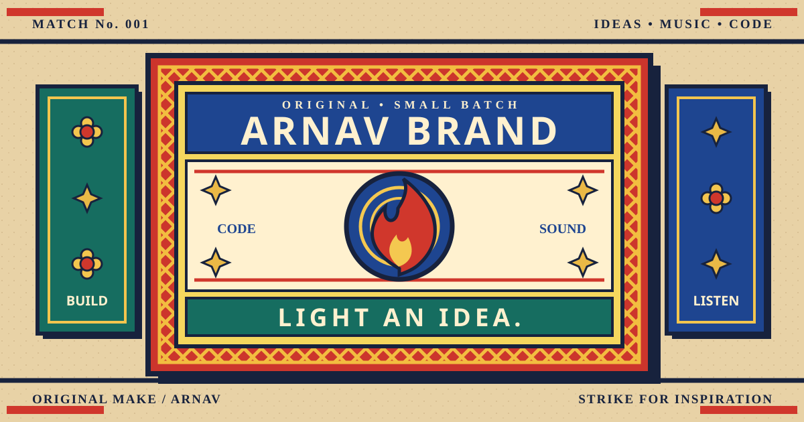

<p align="center">
  
</p>

### Open the box

Hi, I’m **Arnav**. I like building things with code, following a strange idea all the way down, and keeping a good record on while I do it. Currently in a **Daniel Caesar** phase.

I’m drawn to software that reveals something about people, not just software that runs. I also think a little personality can make an interface memorable.

### One of the sparks

**[Agentic Chat Analyzer ↗](https://github.com/andy1924/Agentic-Chat-Analyzer)**

A Python and Streamlit project that turns chat exports into relationship signals and explorable profiles. It’s one example of the kind of experiment I enjoy: part engineering, part curiosity about how people connect.

**[Browse the rest of my work ↗](https://github.com/andy1924?tab=repositories)**

<details>
<summary><strong>✳ read the fine print</strong></summary>

<br>

```text
MATCH NO. 001
MAKER       Arnav
FUEL        code · music · curiosity
ON REPEAT   Daniel Caesar
WARNING     side quests may become full projects
```

If you found something interesting here, [say hi on GitHub](https://github.com/andy1924).

</details>

<p align="center"><sub>strike an idea · see what catches</sub></p>
