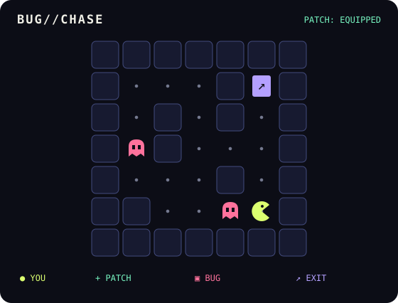

<!-- Generated by scripts/build_arcade.py. -->
[← Back to profile](../README.md) · **BUG//CHASE** · [Restart](room-1-1-0.md)

**Patch equipped.** Reach the purple exit. Watch your next step.



| | [**↑ UP**](room-5-4-1.md) | |
| :---: | :---: | :---: |
| [**← LEFT**](game-over.md) | **● YOU** | · wall · |
| | · wall · | |

<details>
<summary>Text map / how to play</summary>

Coordinates count from the top left, starting at 0. You are at **(5, 5)**.

```text
# # # # # # #
# . . . # E #
# . # . # . #
# ! # . . . #
# . . . # . #
# # . . ! @ #
# # # # # # #
```

`@` you · `#` wall · `+` patch · `!` bug · `E` exit · `.` corridor

Choose an arrow link to move. Collect the patch before entering the exit.
Every room link stores your position and inventory; moves reload the page.

</details>
